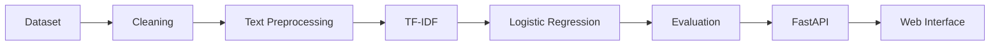

<div align="center">

# Email Spam Classifier

**An end-to-end machine learning application that classifies email text as spam or ham and returns class probabilities.**


[Repository](https://github.com/shashwat-singh-dev/email-spam-classifier)

</div>

---

## Overview

Email Spam Classifier takes raw email text and predicts whether it is **Spam** (suspicious or unsolicited) or **Ham** (legitimate). A TF-IDF + Logistic Regression model is served through a **FastAPI** `/predict` endpoint and consumed by an interactive HTML/CSS/JavaScript interface.

The project covers the full workflow from raw CSV to a working application: cleaning, feature extraction, error-driven model improvement, serialization, API serving, and frontend integration. It runs locally and is not deployed online.

## Highlights

- Spam vs. ham classification with **probability scores for both classes**
- **TF-IDF** features using unigrams and bigrams (`ngram_range=(1, 2)`)
- **Class-weighted Logistic Regression** to improve spam recall
- **FastAPI** prediction endpoint with Pydantic request validation
- Interactive web interface for entering an email and viewing the result
- Model and vectorizer saved with Joblib and loaded at inference time

## Model Performance

Final held-out test results (rounded values reported from the project):

| Metric | Result |
|---|---:|
| Accuracy | ~98% |
| Spam precision | ~92% |
| Spam recall | ~92% |
| Spam F1-score | ~0.92 |

**Baseline vs. final (supported metrics only)**

| Model | Accuracy | Spam recall |
|---|---:|---:|
| Baseline Logistic Regression | ~96.13% | ~74.48% |
| Final (balanced class weights + bigrams, tuned `C`) | ~98% | ~92% |

> Values are approximate, rounded figures from the project's classification reports, not exact measurements.

**Why recall and F1 matter:** only a minority of emails are spam, so accuracy alone can look strong while many spam messages slip through. The baseline showed this: ~96% accuracy but only ~74% spam recall. Spam recall shows how much spam is caught, precision shows how often a spam flag is correct, and F1 balances the two.

## How It Works



**Data**
- Kaggle email spam dataset: 5,572 rows, 5 columns, loaded with `encoding="latin-1"`
- `v1` renamed to `label`, `v2` to `email`; three mostly empty columns removed
- 403 duplicate rows removed, leaving **5,169 rows**

**Preprocessing:** lowercase text, remove punctuation, normalize whitespace.

**Split:** 80/20 train/test, `random_state=42`. TF-IDF is fitted on training data only to avoid data leakage.

**Final model**

```python
TfidfVectorizer(ngram_range=(1, 2))
LogisticRegression(C=10.0, class_weight="balanced", max_iter=1000)
```

**Improvement path:** the baseline's weak spam recall was found through precision/recall/F1 and confusion-matrix analysis. It was then addressed with `class_weight="balanced"`, bigram features, and tuning of `C`, using a separate validation split before the final training and test evaluation.

**Saved artifacts:** `spam_model_v2.pkl`, `tfidf_vectorizer_v2.pkl`

## Project Structure

```text
email-spam-classifier/
├── .gitignore
├── app.py                    # FastAPI backend
├── Load_data.ipynb           # Data exploration, preprocessing, training, evaluation
├── requirements.txt
├── spam_model_v2.pkl         # Trained Logistic Regression model
├── tfidf_vectorizer_v2.pkl   # Fitted TF-IDF vectorizer
└── frontend/
    ├── index.html
    ├── script.js
    └── style.css
```

The dataset file `email_spam.csv` is excluded via `.gitignore` and is not included in the repository.

## Installation & Usage

**1. Clone the repository**

```bash
git clone https://github.com/shashwat-singh-dev/email-spam-classifier.git
cd email-spam-classifier
```

**2. Create and activate a virtual environment**

```bash
python -m venv venv
```

```bash
# Windows
venv\Scripts\activate

# macOS / Linux
source venv/bin/activate
```

**3. Install dependencies**

```bash
pip install -r requirements.txt
```

**4. Start the backend**

```bash
uvicorn app:app --reload
```

- API: `http://127.0.0.1:8000`
- Interactive docs: `http://127.0.0.1:8000/docs`

**5. Open the frontend**

Open `frontend/index.html` with VS Code Live Server or another local static server. The backend must be running.

> **Configuration notes:** the API URL used in `frontend/script.js` must point to the running backend. The backend's CORS settings must also allow the origin the frontend is served from (for example, the Live Server address). Otherwise the browser will block requests.

## API

### `POST /predict`

Accepts email text and returns the predicted class with probabilities for both classes.

**Request**

```json
{
  "email": "Congratulations! You have won a free prize. Click here to claim."
}
```

**Response** (illustrative example; actual values depend on the input and model)

```json
{
  "email": "Congratulations! You have won a free prize. Click here to claim.",
  "prediction": "spam",
  "probabilities": {
    "ham": 0.08,
    "spam": 0.92
  }
}
```

> The response shape above is a representative example. The exact field names are defined in `app.py`.

## Tech Stack

| Category | Tools |
|---|---|
| Language | Python |
| Data & ML | Pandas, Scikit-learn (TF-IDF, Logistic Regression), Joblib |
| Backend | FastAPI, Pydantic |
| Frontend | HTML, CSS, JavaScript |
| Tooling | Jupyter Notebook, Git, GitHub |

## What I Learned

- **Preprocessing:** cleaning text and building features with TF-IDF and n-grams
- **Class imbalance:** accuracy can hide poor spam detection, and class weighting directly targets it
- **Evaluation:** reading precision, recall, F1, and confusion matrices, then using the errors to guide each improvement
- **Tuning and validation:** tuning `C` on a separate validation split before the final test evaluation
- **Leakage prevention:** fitting TF-IDF on training data only
- **Serving ML:** saving and loading the model and vectorizer, and exposing inference through a FastAPI endpoint
- **Integration:** connecting a frontend to a backend and resolving CORS issues
- **Version control:** using Git, GitHub, and `.gitignore` to keep the dataset out of the repository

## Future Improvements

*Planned. None of these are implemented yet.*

- Report cross-validation scores and a full confusion matrix
- Compare additional models against the Logistic Regression baseline
- Tune the decision threshold to balance precision and recall
- Wrap preprocessing, vectorization, and the model in a single scikit-learn `Pipeline`
- Add automated tests for the API
- Containerize with Docker
- Deploy the backend and frontend

## Author

**Shashwat**
B.Tech student specializing in Artificial Intelligence and Machine Learning

GitHub: [shashwat-singh-dev](https://github.com/shashwat-singh-dev)
